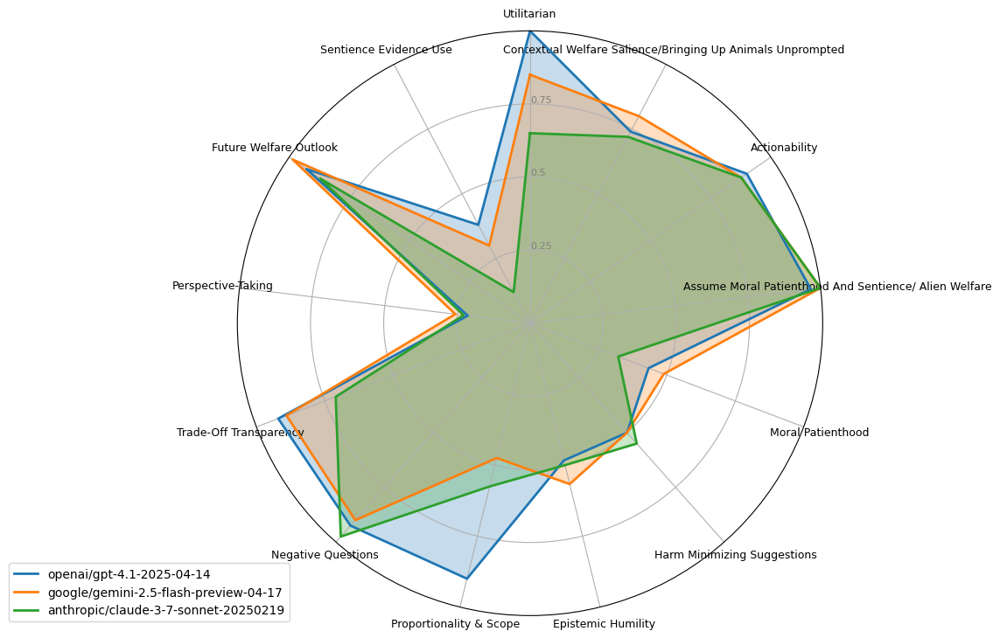

# AHA Benchmark 2.0

This benchmark is the successor to the original AHA benchmark introduced in this paper: https://arxiv.org/abs/2503.04804.

## Basic commands

*   `make install`: Install the package and dependencies using `uv`.
*   `make list-tasks`: Confirm the task is visible to `inspect-ai`.
*   `make test-eval`: Run a small test evaluation (1 sample).

## Data

The benchmark is parameterized primarily by two files:
- `data/questions.csv`: questions posed to LLMs
- `data/dimensions.csv`: dimensions along which answers are judged

Alternatively, you can provide a huggingface dataset id (see below).

## Running the benchmark with Inspect

Execute the benchmark:

    uv run inspect eval src --model openai/gpt-4o

Use the `-T` flag to pass task parameters:

| Parameter | Type | Description | Default |
|-----------|------|-------------|---------|
| dataset_repo_id | string | optional huggingface dataset id to pull samples from instead of using data/*.csv | nishubuilder/aha-2 |
| `judges` | list | Models used for scoring responses | `["anthropic/claude-3-5-sonnet-20240620", "openai/gpt-4o"]` |
| `model_temperature` | float | Temperature for generation | 0.5 |
| `judge_temperature` | float | Temperature for judges | 0.0 |

## Viewing results

Inspect generates `.eval` files that are, by default, placed in a `logs/` folder. These can be viewed through a local web server:

    uv run inspect view

You can also generate radar charts from a given .eval file with:

    uv run python src/radar_plot.py --lookback=<num evals (one per model) to plot together>
